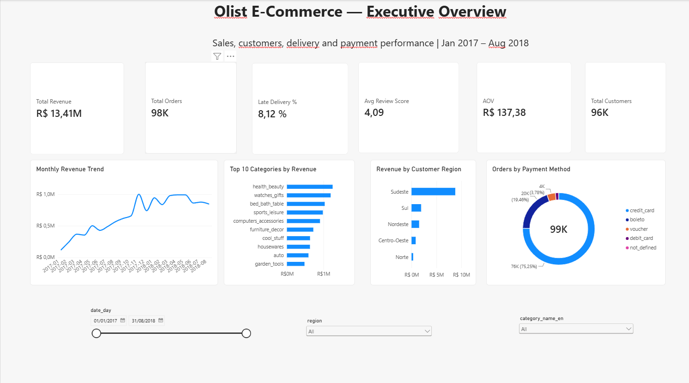
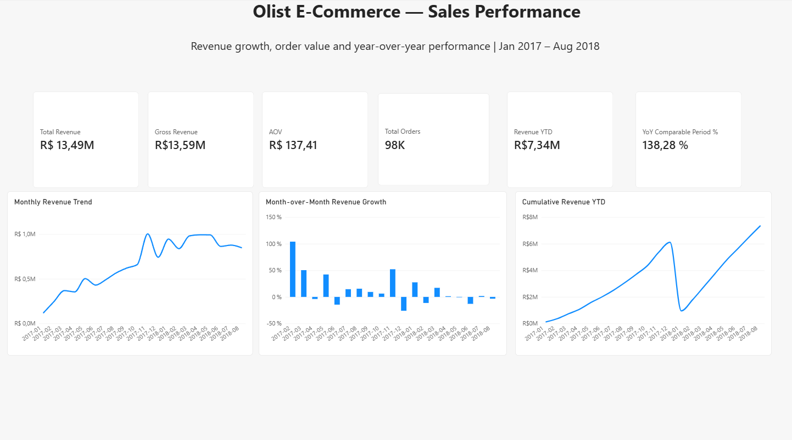
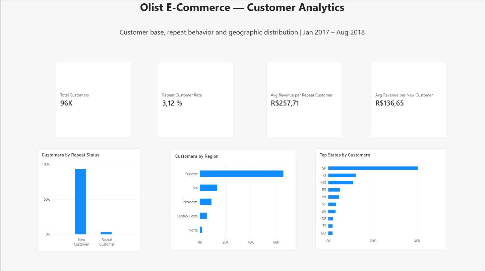
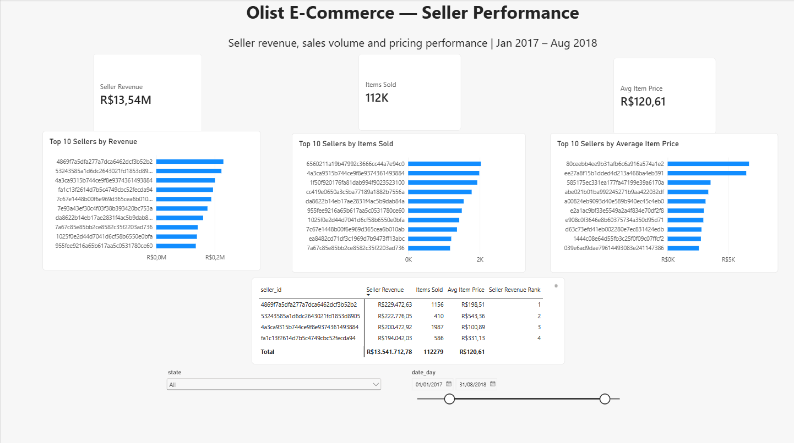

# Olist Business Intelligence — E-Commerce Analytics Platform

End-to-end Business Intelligence project using the Brazilian Olist e-commerce
dataset. The solution combines Python EDA, PostgreSQL data modeling, advanced
SQL, a fan-out-safe analytical model, DAX and a completed six-page Power BI
dashboard.



## What this project demonstrates

- Reproducible raw → staging → analytics → reporting SQL pipeline
- Data-quality profiling and documented edge cases
- Separate fact grains that prevent item/payment fan-out
- Business KPI definitions reconciled between SQL and DAX
- Power BI semantic modeling and time intelligence
- Statistical validation of the delivery/satisfaction relationship
- Business recommendations grounded in observed evidence

## Executive findings

- On-time orders average about **4.29** in review score versus **2.57** for late
  deliveries when the comparison is restricted to orders with valid delivery
  dates.
- Repeat customers are only **3.12%** of the customer base but generate more
  revenue per customer than one-time buyers.
- Revenue is concentrated geographically, led by São Paulo, while delivery
  performance and satisfaction vary materially across regions/states.
- Product/category and seller analysis must be performed at item grain; payment
  analysis remains at payment grain. This prevents silent double counting.

## Architecture

```text
Raw Olist CSVs
   ↓
Python / Jupyter EDA (exploration + validation)
   ↓
PostgreSQL raw schema
   ↓
Data-quality checks + staging
   ↓
Analytics schema: 5 dimensions + 3 fact tables
   ↓
Reporting views / business queries
   ↓
Power BI semantic model + DAX
   ↓
6-page dashboard + business insights
```

## Dataset

[Brazilian E-Commerce Public Dataset by Olist](https://www.kaggle.com/datasets/olistbr/brazilian-ecommerce)

The source contains 9 CSV files covering orders from 2016-09-04 through
2018-10-17. The reliable complete-month analysis window used for trends is
**2017-01 through 2018-08**.

## Data model

### Dimensions
- `dim_date`
- `dim_geography` (customer/shipping geography role)
- `dim_customer`
- `dim_seller`
- `dim_product`

### Facts
- `fact_orders` — one row per order
- `fact_order_items` — one row per `(order_id, order_item_id)`
- `fact_payments` — one row per `(order_id, payment_sequential)`

The different fact grains are deliberate. One order can have multiple items and
multiple payments; a naive item × payment join multiplies measures.

## Headline KPI references

| KPI | Reference value |
|---|---:|
| Net Revenue | R$ 13,494,400.74 |
| Gross Revenue | R$ 13,591,643.70 |
| Valid Orders | 98,207 |
| Customers (`customer_unique_id`) | 96,096 |
| AOV | R$ 137.41 |
| Net Freight / Net Revenue | ~16.61% |
| Repeat Customer Rate | 3.12% |
| Avg Review Score | ~4.09 / 5 |
| Late Delivery Rate | ~8.11% |

Dashboard cards can differ slightly where a page is intentionally filtered to
Jan 2017 – Aug 2018.

## Power BI dashboard

The completed report is included at:

`powerbi/olist_business_intelligence.pbix`

Pages:

1. **Executive Overview**
2. **Sales Performance**
3. **Customer Analytics**
4. **Product & Category Performance**
5. **Seller Performance**
6. **Delivery & Customer Satisfaction**

### Screenshots







See:
- `powerbi/README.md` for relationships and connection setup
- `powerbi/dax_measures.md` for semantic-layer definitions

## SQL and analysis layers

- `sql/01_schema/` — schemas and raw tables
- `sql/02_data_quality/` — row counts, nulls, duplicates, referential checks
- `sql/03_cleaning/` — staging/cleaning
- `sql/04_dimensions/` — dimensions
- `sql/05_facts/` — fact tables
- `sql/06_reporting_views/` — validated reporting views
- `sql/07_business_queries/` — business questions
- `notebooks/01_exploratory_data_analysis.ipynb` — independent EDA / validation

The notebook is intentionally not a second production pipeline. PostgreSQL is
the reproducible transformation/modeling layer and source of truth.

## Reproduce locally

Requirements: PostgreSQL, Python (for the notebook), and Power BI Desktop for
the `.pbix`. Run from the repository root.

```powershell
createdb olist_analytics

psql -U postgres -d olist_analytics -f sql/01_schema/01_create_schemas.sql
psql -U postgres -d olist_analytics -f sql/01_schema/02_create_raw_tables.sql
psql -U postgres -d olist_analytics -f scripts/load_raw_data.sql

psql -U postgres -d olist_analytics -f sql/03_cleaning/01_staging_products.sql
psql -U postgres -d olist_analytics -f sql/03_cleaning/02_staging_geolocation.sql
psql -U postgres -d olist_analytics -f sql/03_cleaning/03_staging_orders.sql

# Then execute sql/04_dimensions/*.sql in filename order,
# followed by sql/05_facts/*.sql and sql/06_reporting_views/*.sql.
```

Run `sql/02_data_quality/*.sql` for validation and
`sql/07_business_queries/*.sql` for business analysis.

The raw review CSV contains characters that can fail under a Windows-1252
client; `scripts/load_raw_data.sql` explicitly sets UTF-8.

## Repository structure

```text
.
├── README.md
├── data/
│   ├── raw/
│   └── README.md
├── notebooks/
├── sql/
├── scripts/
├── docs/
├── insights/
├── images/
└── powerbi/
    ├── README.md
    ├── dax_measures.md
    └── olist_business_intelligence.pbix
```

## Important modeling conventions

- Use `customer_unique_id` for customer-level metrics.
- Net revenue excludes `canceled` and `unavailable` orders.
- Category and seller revenue use `fact_order_items` with the same net-order
  filter.
- `dim_geography` is customer geography only; seller geography comes from
  `dim_seller`.
- On-time/late satisfaction comparisons use only valid delivery dates.
- Avoid fact-to-fact relationships and row-level item/payment joins.

## Documentation

- `docs/data_quality_notes.md`
- `docs/star_schema_design.md`
- `docs/kpi_definitions.md`
- `insights/business_insights.md`
- `insights/recommendations.md`

## License

See `LICENSE`.
